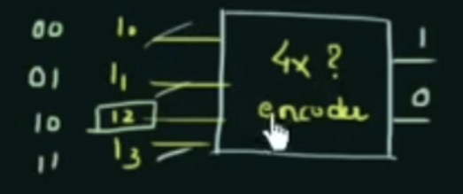
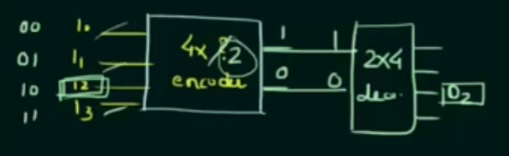

# Introduction to Encoders and Decoders

## Overview

Encoders and decoders are fundamental **combinational logic circuits** used in digital systems to convert data between different forms.

An **encoder** takes multiple input lines and produces a smaller number of output lines that represent the active input in binary form. A **decoder** performs the reverse operation, taking a binary input and activating the corresponding output line.

In simple terms, if a valid input is passed into an encoder and then through its corresponding decoder, the original input can be reconstructed.

---

## What is an Encoder?

An encoder is a combinational circuit with:

- **n input lines**
- **m output lines**

The purpose of an encoder is to reduce the number of data lines needed to represent information. Instead of sending a signal across many separate input lines, the encoder converts the active input into a binary code on fewer output lines.

This works under the assumption that **only one input line is active at a time**.

### Example Concept

For a 4-to-2 encoder:

- There are **4 input lines**
- There are **2 output lines**

The 2-bit output represents the number of the input line that is high.

For example:

| Active Input | Output |
|--------------|--------|
| D0           | 00     |
| D1           | 01     |
| D2           | 10     |
| D3           | 11     |

This demonstrates how the encoder minimizes the number of lines required to communicate which input is active.

---

## What is a Decoder?

A decoder is the reverse of an encoder.

It takes a binary input and activates one corresponding output line. In other words, a decoder expands encoded information back into its original form.

For a 2-to-4 decoder:

- There are **2 input lines**
- There are **4 output lines**

Each binary input value selects exactly one output line.

| Input | Active Output |
|-------|---------------|
| 00    | D0            |
| 01    | D1            |
| 10    | D2            |
| 11    | D3            |

Because of this reverse relationship, encoders and decoders are often introduced together.

---

## Relationship Between Encoders and Decoders

Encoders and decoders are complementary circuits:

- An **encoder** compresses multiple input lines into a binary code
- A **decoder** expands that binary code back into a single active output

When used together correctly, they allow a system to convert signals into a more compact form and then recover the original selection later.

---

## Types of Encoders

There are several common types of encoders used in digital electronics:

### 1. Priority Encoder
A priority encoder is designed to handle cases where **more than one input may be active at the same time**. It assigns priority to one input over the others and outputs the binary code of the highest-priority active input.

### 2. Decimal to BCD Encoder
This encoder converts a **decimal input** into its corresponding **Binary-Coded Decimal (BCD)** representation.

### 3. Octal to Binary Encoder
An octal-to-binary encoder converts one of **8 input lines** into a **3-bit binary output**.

### 4. Hexadecimal to Binary Encoder
A hexadecimal-to-binary encoder converts one of **16 input lines** into a **4-bit binary output**.

---

## Applications

Encoders are commonly used in digital systems for:

- Reducing the number of data lines
- Data compression in logic circuits
- Keyboard input encoding
- Interrupt handling
- Digital communication systems

Decoders are used for:

- Output selection
- Memory address decoding
- Display systems
- Device control

---

## Conclusion

Encoders and decoders are essential building blocks in digital logic design. An encoder reduces multiple inputs into a compact binary form, while a decoder restores that binary information into a specific output line. Understanding how these circuits work is important for studying more advanced digital systems and computer engineering concepts.

---
# Priority Encoders
